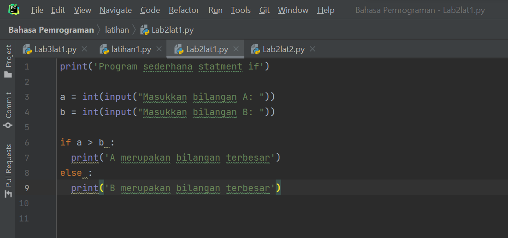
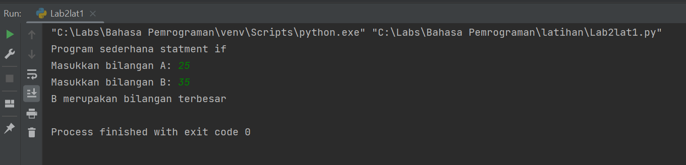
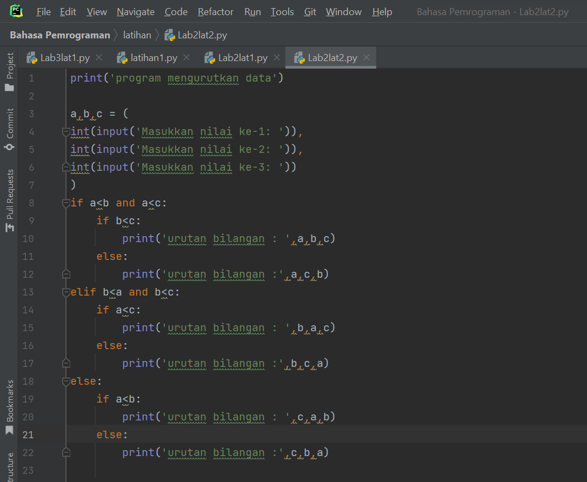
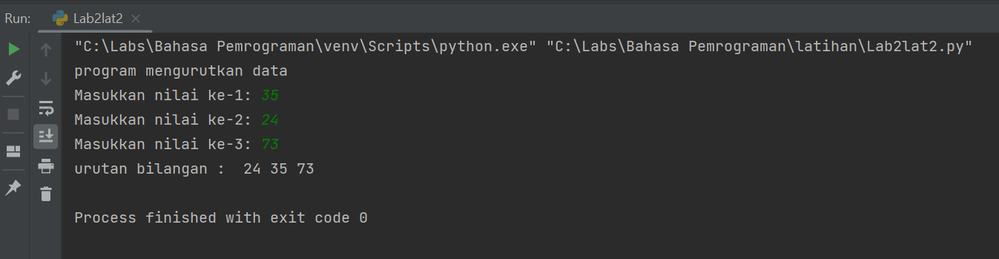
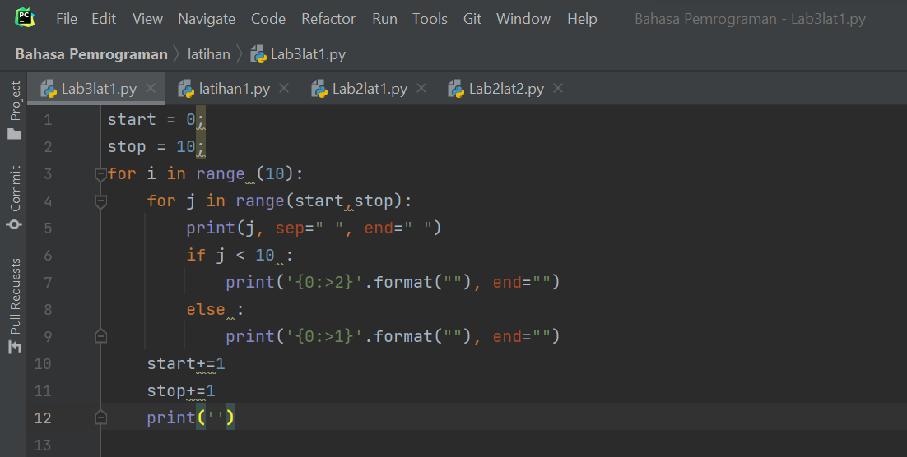
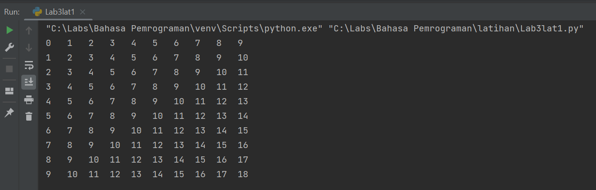
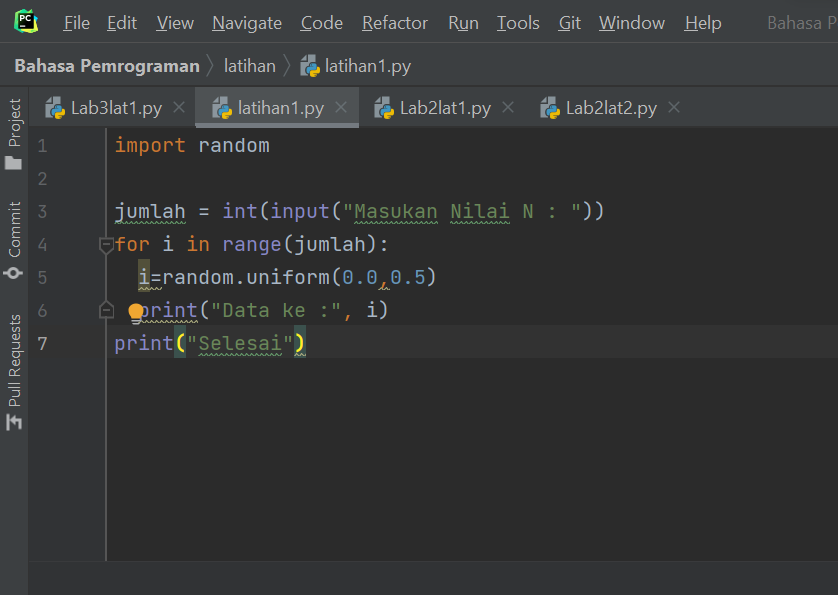
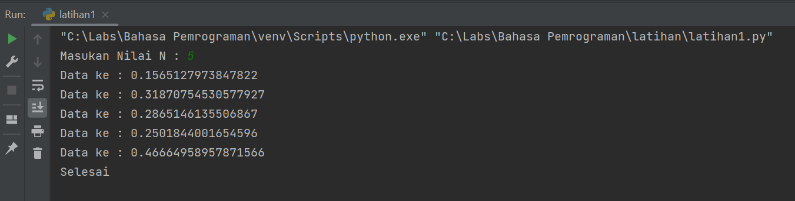

# Praktikum4
## Source code and output (Hasil running program)

## Lab 2 : Struktur Kondisi
## Latihan 1
### Buat program sederhada dengan input 2 buah bilangan, kemudian
### tentukan bilangan terbesar dari kedua bilangan tersebut
### menggunakan statement if.

## Latihan 2
### Buat program untuk mengurutkan data berdasarkan input sejumlah
### data (minimal 3 variable input atau lebih), kemudian tampilkan
### hasilnya secara berurutan mulai dari data terkecil.

## Lab 3 : Perulangan
## Latihan 1
### Buat program dengan perulangan bertingkat (nested) for

## Latihan 2
### Tampilkan n bilangan acak yang lebih kecil dari 0.5.
### nilai n diisi pada saat runtime
### anda bisa menggunakan kombinasi while dan for

